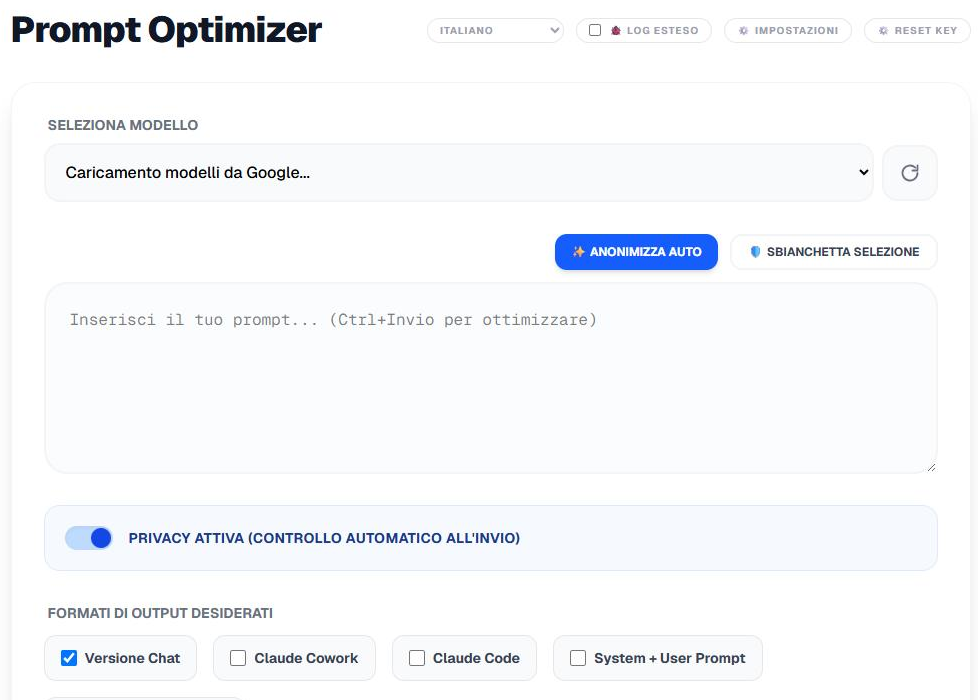

# Prompt Optimizer

[English](README.md) · **Italiano**

Prompt Optimizer nasce da un'idea semplice: **aiutarti a scrivere buoni prompt.**
Per farlo si appoggia al **tier gratuito di Google Gemini via API** — e proprio
*perché* il tuo prompt viene inviato a Gemini, **anonimizza i dati sensibili che
Gemini riceve**: le PII (email, telefono, carte) vengono rilevate e mascherate
**sul tuo dispositivo** prima della chiamata, poi ripristinate nell'output.
Prompt migliori, senza consegnare i tuoi dati personali al modello.

App desktop (Windows, via **Tauri**) — nessun backend proprio: tutto gira
client-side nella webview Tauri, con le tue API key salvate solo sul dispositivo.




[](https://github.com/CalvinTTooS/prompt-optimizer/releases/latest)

[](LICENSE)

> 🤖 Sviluppato con l'assistenza dell'IA, seguendo standard di sviluppo rigidi e versionati — vedi [Sviluppo](#sviluppo).

## Scarica

Scarica l'ultima versione dalla pagina **[Releases](https://github.com/CalvinTTooS/prompt-optimizer/releases/latest)**:

- **Installer (consigliato)**: `Prompt_optimizer_x.y.z_x64-setup.exe` — installazione nel profilo utente, **senza diritti di amministratore**.
- **Portable**: `pop_app.exe` — eseguibile singolo da copiare e lanciare (richiede **WebView2**, di norma già presente su Windows 10/11).

> ⚠️ L'app non è firmata: al primo avvio Windows **SmartScreen** può avvisare → *"Ulteriori informazioni" → "Esegui comunque"*.
> Guida completa: [manuale utente](docs/manuale-utente.md) · [user manual (EN)](docs/user-manual.md).

## Cosa fa

- **Ottimizza un prompt** in fino a 5 varianti: Claude Chat, Claude Cowork,
  Claude Code (CLI), coppia System+User (API), file istruzioni Gemini
  (`GEMINI.md`). Motore: Google **Gemini** con la tua API key.
- **Anonimizzazione PII** (email, telefono, carte/CCV con validazione Luhn)
  prima dell'invio al modello, con ripristino automatico nell'output.
- **Rifinisci / Valuta** ogni variante con **Claude** (API) o **OpenAI** (API)
  — vedi "Provider layer". Switch per motore in ⚙️ Impostazioni.
- **Esempi few-shot** condivisi, iniettati in tutti i formati selezionati.
- **Scaffold strutturato**: genera il set completo di file di istruzioni per un
  progetto software (`CLAUDE.md`, `GEMINI.md`, `METHOD.md`, profili di
  piattaforma), con "istruzioni aggiuntive" visualizzabili/modificabili/
  ripristinabili per-file.
- Notifiche **toast** in-app.

## Come funziona

1. **Incolli un prompt grezzo** — anche una riga buttata lì.
2. **Le PII vengono anonimizzate localmente** (attivo di default): email,
   numeri di telefono, carte di credito (validate con Luhn) e CCV vengono
   rilevati e sostituiti con segnaposto tipo `[EMAIL_1]` *prima* di inviare
   qualsiasi cosa. Gemini vede solo il testo mascherato; i valori reali vengono
   ripristinati nell'output finale. Puoi anche mascherare a mano qualsiasi
   testo selezionato.
3. **Gemini lo riscrive** nei formati che spunti — ciascuno tarato su come quel
   target legge davvero i prompt:
   - **Claude Chat** — discorsivo, con tag XML, per le UI di chat.
   - **Claude Cowork** — agente di workspace, con confini espliciti e punti di
     approvazione umana.
   - **Claude Code** — istruzioni per agente CLI (genere `CLAUDE.md`): prima
     pianifica, poi agisce, con passi verificabili.
   - **System + User** — divide il prompt in una parte **system** (stabile:
     ruolo, vincoli, formato di output) e una parte **user** (il task/i dati
     specifici), con un unico criterio: *"questa riga resterebbe identica se
     rieseguissi il task domani con dati diversi?"* → sì → System, no → User.
   - **File istruzioni Gemini** (`GEMINI.md`) — un file di contesto per Gemini
     CLI: consapevole della gerarchia, indipendente dal nome file,
     interoperabile con `AGENTS.md`.
4. **Gli esempi few-shot** che fornisci vengono iniettati in tutti i formati
   selezionati in una volta sola.
5. **Rifinisci / Valuta** ogni variante con Claude o OpenAI (vedi *Provider
   layer*), tenendo le chiavi in locale.
6. **Scaffold strutturato** (modalità separata): da una descrizione di progetto,
   Gemini compila solo la sezione "Progetto" di un template e l'app assembla il
   set completo di istruzioni per agenti — `CLAUDE.md` + `GEMINI.md` +
   `METHOD.md` + profili di piattaforma — da scaricare come cartella o zip.

Tutto gira client-side nella shell Tauri; niente passa da un nostro server.

## Requisiti

- **Node.js** + npm.
- Toolchain **Rust/Cargo** (per la build desktop Tauri).

## Avvio e build

```bash
npm install
npm run tauri dev      # shell desktop completa
npm run tauri build    # eseguibile + installer
```

> `npm run dev` da solo avvia **solo** la webview Next.js nel browser, senza le
> API Tauri (store, download nativi). Per usare l'app serve la shell Tauri.

Questo repo produce una **build unica solo-API**: nessuna feature flag, nessuna
dipendenza da un CLI locale. `npm run tauri dev`/`npm run tauri build` — senza
alcun flag — bastano sempre.

## Privacy

I tuoi **prompt** vengono inviati a **Google Gemini** per l'ottimizzazione e, se
usi Rifinisci/Valuta via API, al provider scelto (**Anthropic** e/o **OpenAI**).
Le **API key** (Gemini, Anthropic, OpenAI) sono salvate **solo sul tuo dispositivo**
(`tauri-plugin-store`), non vengono mai loggate, e le chiamate escono
direttamente verso gli endpoint dei provider — **nessun backend proprietario**
nel mezzo.

## Sviluppo

Questo software è stato **sviluppato con l'assistenza dell'IA**, seguendo un
insieme di standard di sviluppo rigidi e versionati — progettare prima di
scrivere codice, un gate di test a ogni modifica, sicurezza *by design* e igiene
del codice. Questi standard non sono impliciti: sono scritti e vivono nel repo.

- [`CLAUDE.md`](CLAUDE.md) — direttive specifiche di progetto, caricate ogni sessione.
- [`docs/METHOD.md`](docs/METHOD.md) — la metodologia di ingegneria completa e stabile.
- [`AGENTS.md`](AGENTS.md) — note per agenti cross-tool.
- [`CONTRIBUTING.md`](CONTRIBUTING.md) — setup, gate di test e convenzioni.
- [`docs/prompt-engineering-best-practices.md`](docs/prompt-engineering-best-practices.md)
  — la ricerca (con fonti) dietro ogni formato di prompt.

## Contatti e segnalazioni

Domande, bug o proposte? Apri una **[issue su GitHub](https://github.com/CalvinTTooS/prompt-optimizer/issues)** — è il modo migliore per contattarmi: resta pubblico, tracciabile e non serve scambiarsi email.

## Licenza

[MIT](LICENSE).

---

## Provider layer (Rifinisci / Valuta)

Le azioni "Rifinisci"/"Valuta con Claude" nel `ResultViewer` non parlano a un
unico backend: girano su un **layer di provider** intercambiabile
(`app/lib/providers/`, orchestrato da `availableProviders()` in
`app/lib/providers/registry.ts` e consumato da `app/hooks/useClaudeRefine.ts`).
Ogni provider implementa la stessa interfaccia `LlmProvider` (`run(assembled,
tier) → { text, usage }`, in `app/lib/providers/types.ts`) e compare come
pulsante separato in UI quando disponibile:

- **Claude API** (`claude-api`, label "Claude (API)") — `app/lib/providers/claudeApi.ts`.
  Attivo quando è presente una API key Anthropic in ⚙️ Impostazioni.
- **OpenAI API** (`openai-api`, label "OpenAI (API)") — `app/lib/providers/openaiApi.ts`.
  Attivo quando è presente una API key OpenAI in ⚙️ Impostazioni.

Le API key dei due provider si inseriscono nel pannello ⚙️
Impostazioni e restano **solo locali** (stesso store `tauri-plugin-store` usato
per la chiave Gemini); le chiamate escono direttamente dalla webview via
`tauri-plugin-http` verso gli endpoint Anthropic/OpenAI — nessun backend
proprio nel mezzo. Il monitor di consumo in UI accumula i token restituiti da
ogni provider (solo token, non prezzo). Ogni motore può essere attivato/
disattivato dagli switch in ⚙️ Impostazioni (master + per-motore).
