# Prompt Optimizer — Manuale utente

Prompt Optimizer è un'app desktop per Windows che trasforma un prompt grezzo
in **varianti ottimizzate** per diversi target AI, con **anonimizzazione dei dati
personali** e un generatore di **file di istruzioni per progetti software**.
Tutto gira in locale: non c'è nessun server intermedio, e le tue chiavi API
restano sul tuo dispositivo.

> Versione inglese di questo manuale: [user-manual.md](user-manual.md).

---

## 1. Requisiti

- **Windows 10 o 11.**
- Una **API key di Google Gemini** (gratuita da creare — vedi §3).
- *(Facoltativo)* API key **Anthropic** e/o **OpenAI**, se vuoi usare le
  funzioni **Rifinisci/Valuta** (§7).
- **WebView2**: è il motore di rendering. È già presente su quasi tutti i
  Windows 10/11 (incluso di serie in Windows 11); se manca, l'installer lo
  scarica e installa **da solo, senza chiederti diritti di amministratore**.

---

## 2. Installazione

L'app si installa con un **installer che non richiede diritti di amministratore**:
viene installata nel tuo profilo utente (come fa Chrome quando non ha accesso a
"Programmi").

1. Avvia il file di installazione (`Prompt optimizer_x.y.z_x64-setup.exe`).
2. Se compare l'avviso **SmartScreen** di Windows ("Windows ha protetto il PC" /
   "editore sconosciuto"), è normale per le app non firmate: clicca
   **"Ulteriori informazioni" → "Esegui comunque"**.
3. Segui l'installazione: l'app finisce in `%LOCALAPPDATA%`, con collegamento nel
   menu Start. Se WebView2 non è presente, viene installato automaticamente.
4. Avvia **Prompt Optimizer** dal menu Start.

La procedura dell'installer, passo per passo:

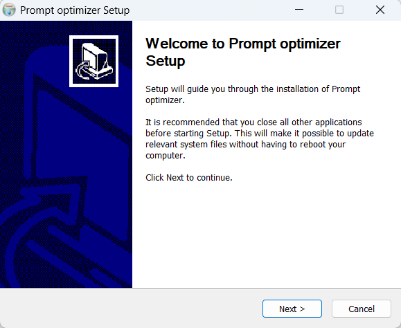

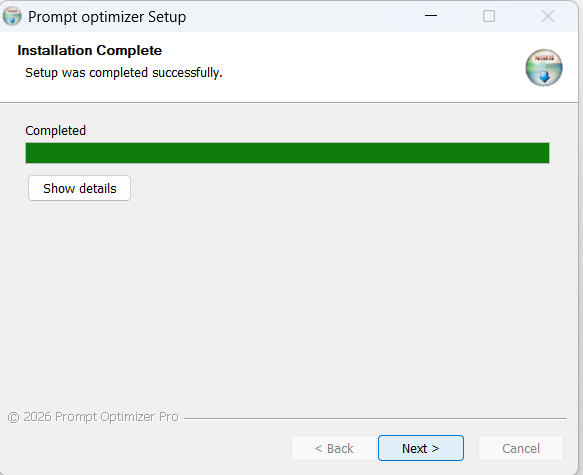
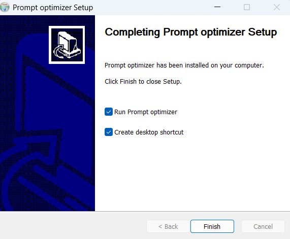

> L'installer è in inglese (è quello standard di Windows), ma è la stessa
> procedura a prescindere dalla lingua scelta poi nell'app.

**Alternativa portable:** esiste anche l'eseguibile singolo
(`pop_app.exe`) che puoi copiare e lanciare senza installare — funziona a patto che
WebView2 sia già presente sul PC (di norma lo è).

---

## 3. Primo avvio — configurazione della chiave Gemini

Al primo avvio compare la schermata di **Setup**.

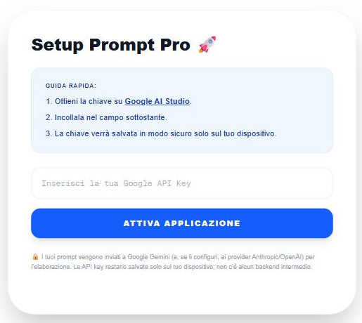

1. Vai su **[Google AI Studio](https://aistudio.google.com/app/apikey)** e crea
   una **API key** (gratuita).
2. Incolla la chiave nel campo **"Inserisci la tua Google API Key"**.
3. Clicca **"Attiva Applicazione"**.

La chiave viene salvata **in modo sicuro solo sul tuo dispositivo**. I tuoi prompt
vengono inviati a Google Gemini (e, se li configuri, ai provider API scelti) per
l'elaborazione: non c'è nessun backend intermedio.

---

## 4. Panoramica dell'interfaccia

- **In alto (header):** titolo, numero di versione, selettore **lingua** (§9),
  toggle **🐞 Log esteso** (§10), **⚙️ Impostazioni** (§7), **Reset Key**.
- **Editor:** la grande casella di testo dove incolli il prompt da ottimizzare
  (è la stessa usata anche dalla modalità Scaffold, §8). **Invio** va a capo; per
  ottimizzare usa il pulsante (o **Ctrl+Invio**).
- **Formati di output:** le caselle per scegliere quali varianti generare.
- **Pulsante Ottimizza:** avvia la generazione.
- Più in basso: la sezione **Scaffold** (§8) e i **consigli** (Masterclass).

---

## 5. Ottimizzare un prompt

1. **Incolla il prompt** grezzo nella casella di testo.
2. **(Consigliato) Privacy:** lascia attivo lo switch **"Privacy Attiva"**.
   All'invio, l'app rileva e maschera automaticamente i dati personali (email,
   telefoni, carte di credito con validazione) sostituendoli con segnaposto tipo
   `[EMAIL_1]`; nell'output vengono ripristinati. Puoi anche selezionare del testo
   e usare **"Censura manuale"**. I dati mascherati compaiono nel pannello **"Dati
   protetti"**, da cui puoi ripristinarli singolarmente o tutti.
   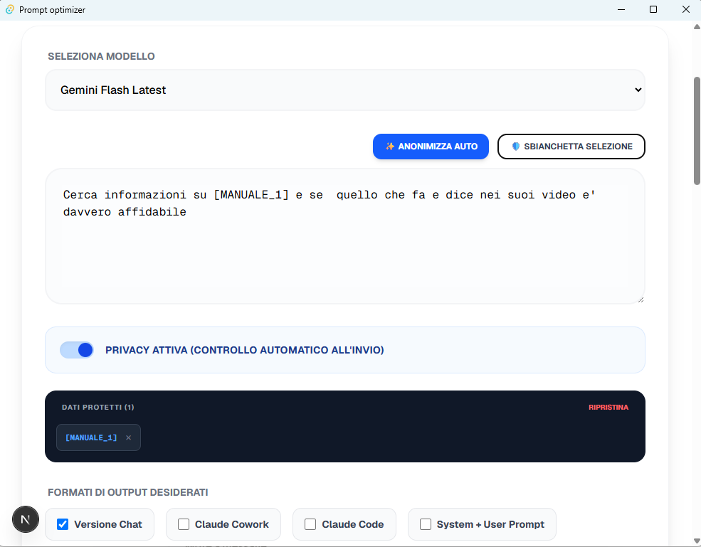
3. **Scegli i formati di output** (uno o più):
   - **Versione Chat** — per Claude Chat (Web), discorsivo.
   - **Claude Cowork** — per un agente collaborativo.
   - **Claude Code** — per l'esecuzione autonoma da terminale.
   - **System + User Prompt** — coppia strutturata per le API.
   - **File istruzioni Gemini** — un `GEMINI.md`.
4. **(Facoltativo) Esempi / few shot:** apri la sezione e aggiungi uno o più
   esempi con **"+ Aggiungi esempio"**. Gli esempi valgono **per tutti i formati
   selezionati** e guidano lo stile dell'output.
   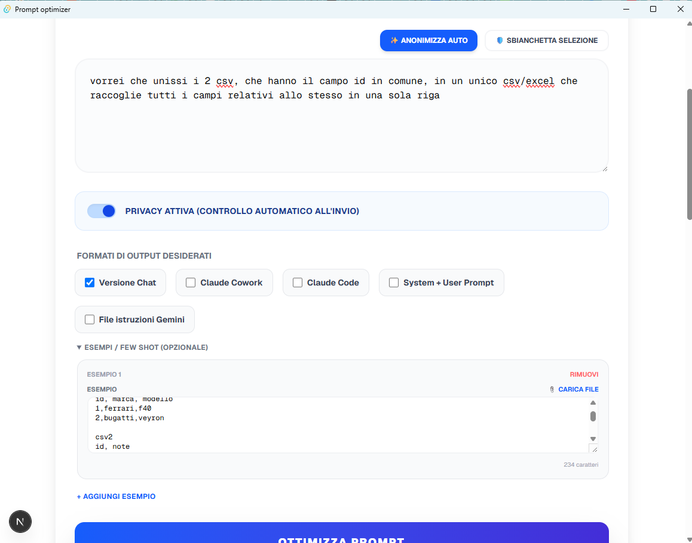
5. Scegli il **modello Gemini** dal menu (se disponibili più modelli). Accanto
   al menu c'è il pulsante **↻ (ricarica modelli)**: se all'avvio eri **offline**
   la lista non si carica — collegati a Internet e premi ↻ per riprovare, senza
   chiudere l'app.
6. Clicca **"Ottimizza Prompt"** (o **Ctrl+Invio**).

### I risultati

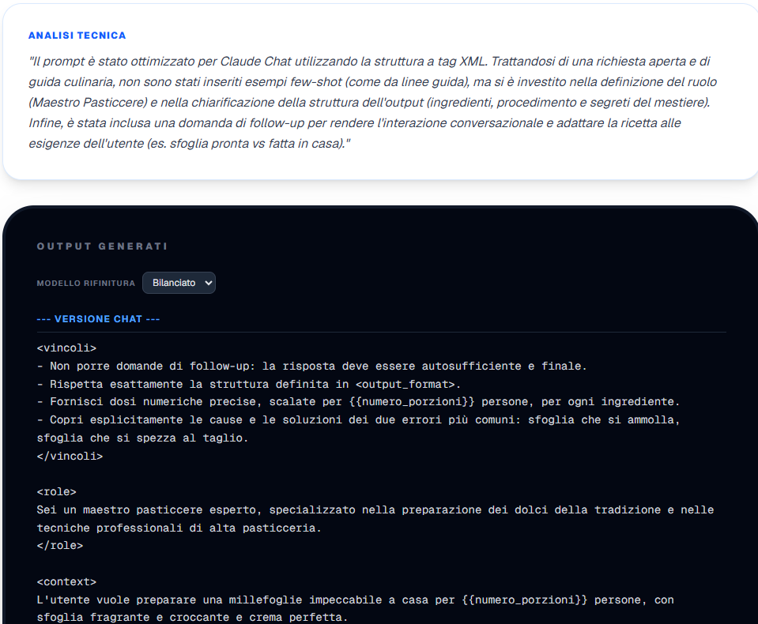

Per ogni variante trovi il testo generato, un **badge di analisi** (linter), i
pulsanti **📋 Copia** e, dove applicabile, **scarica come file `.md`**. Se hai
usato variabili `{{...}}`, puoi compilarle e vederle sostituite.

---

## 6. Analisi e variabili

- Il **badge linter** segnala meccanicamente possibili migliorie (domande di
  follow-up, segnaposto lasciati, lunghezza, ecc.) — gratis e offline.
- Le **variabili** rilevate nel prompt (tra `{{ }}`) si possono compilare per
  ottenere la versione finale pronta all'uso.

---

## 7. Rifinire e valutare con un'AI (Claude API / OpenAI API)

Accanto a ogni variante puoi avere i pulsanti **"Rifinisci con …"** e **"Valuta
con …"**, che usano un'AI per **migliorare** o **giudicare** il prompt. I motori
disponibili dipendono da cosa hai configurato in **⚙️ Impostazioni**.

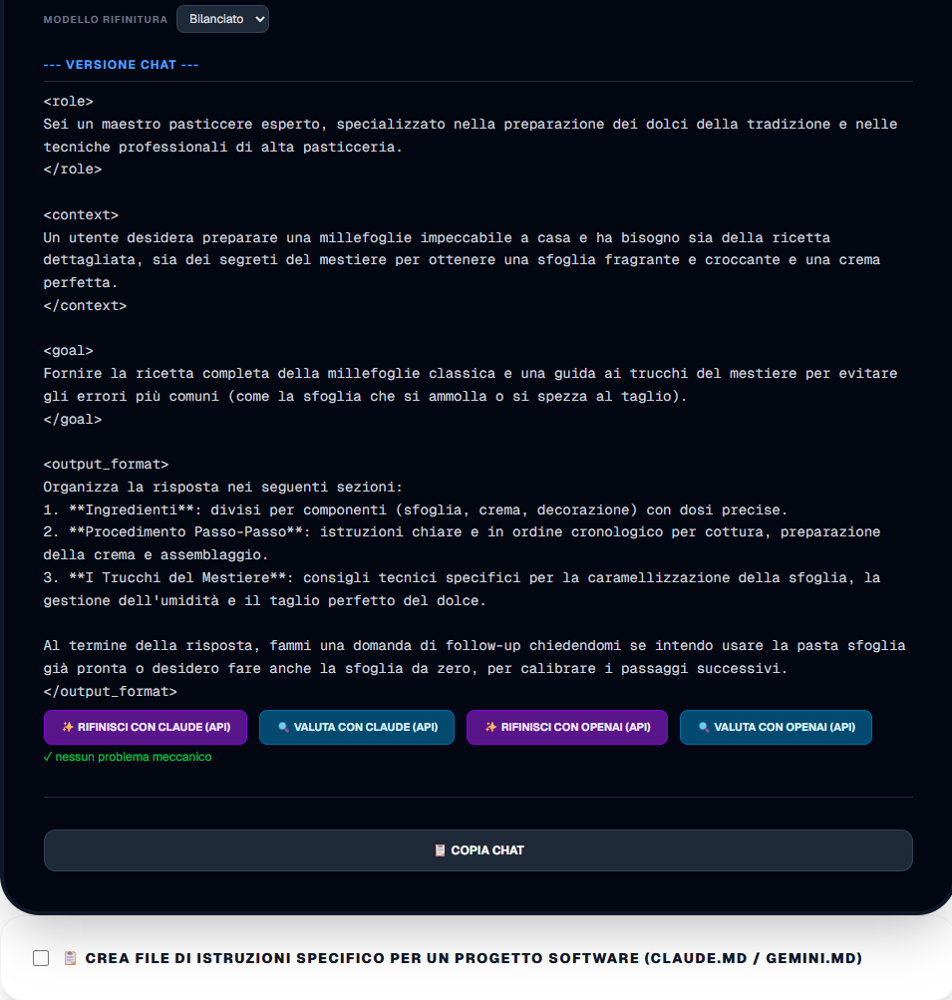

### I due motori
- **Claude (API)** — usa una **API key Anthropic**.
- **OpenAI (API)** — usa una **API key OpenAI**.

### Le Impostazioni (⚙️)

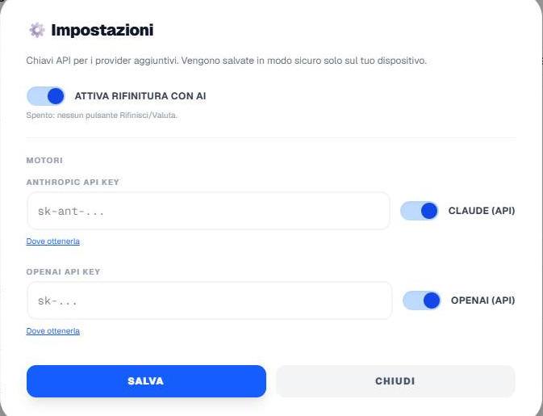

- **Switch master "Attiva rifinitura con AI":** se spento, **nessun** pulsante
  Rifinisci/Valuta compare.
- **Chiavi API:** inserisci la key **Anthropic** e/o **OpenAI** (con il link "Dove
  ottenerla") e premi **Salva**. Un motore appare solo dopo aver salvato la key.
- **Switch per motore** (Claude API, OpenAI API): accendi/spegni ogni
  motore singolarmente. Un pulsante compare solo se: master acceso **e** switch
  del motore acceso **e** motore disponibile (key salvata).

> **Nota costi:** le funzioni API usano la **tua** chiave e consumano il **tuo**
> credito. Errori tipici: `401 API key is invalid` (chiave non valida) o
> `429 no credits` (credito esaurito) indicano un problema del tuo account, non
> dell'app.

---

## 8. Modalità Scaffold — file di istruzioni per un progetto software

Questa modalità genera in un colpo solo il **set completo di file di istruzioni
per gli agenti AI** di un progetto di sviluppo: `CLAUDE.md`, `GEMINI.md`,
`METHOD.md` e i profili di piattaforma.

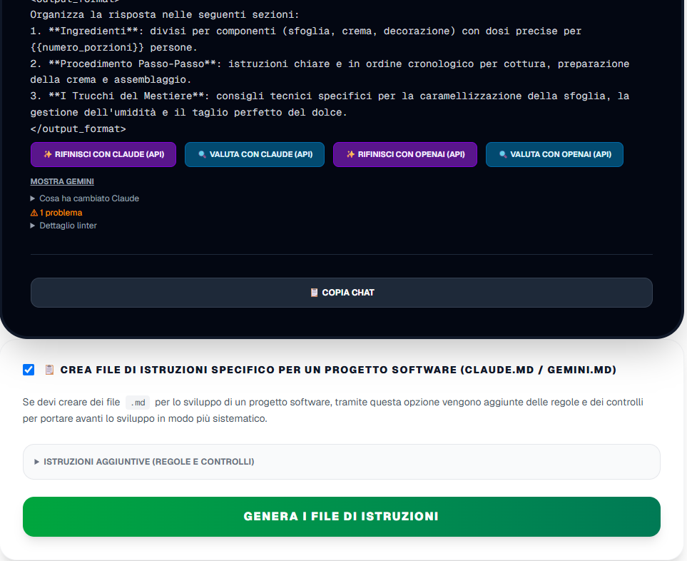

1. **Descrivi il tuo progetto** nella casella di testo grande in alto (cosa fa,
   per chi, tecnologie).
2. Spunta la checkbox **"📋 Crea file di istruzioni specifico per un progetto
   software (CLAUDE.md / GEMINI.md)"**: si apre il pannello. ⚠️ Usa il **testo
   scritto in alto** come descrizione del progetto.
3. *(Facoltativo)* **Istruzioni aggiuntive:** apri la sezione per **visualizzare,
   modificare o ripristinare** le regole fisse che verranno aggiunte (scegli il
   file dal menu; le modifiche restano salvate finché non premi "Ripristina
   default").
   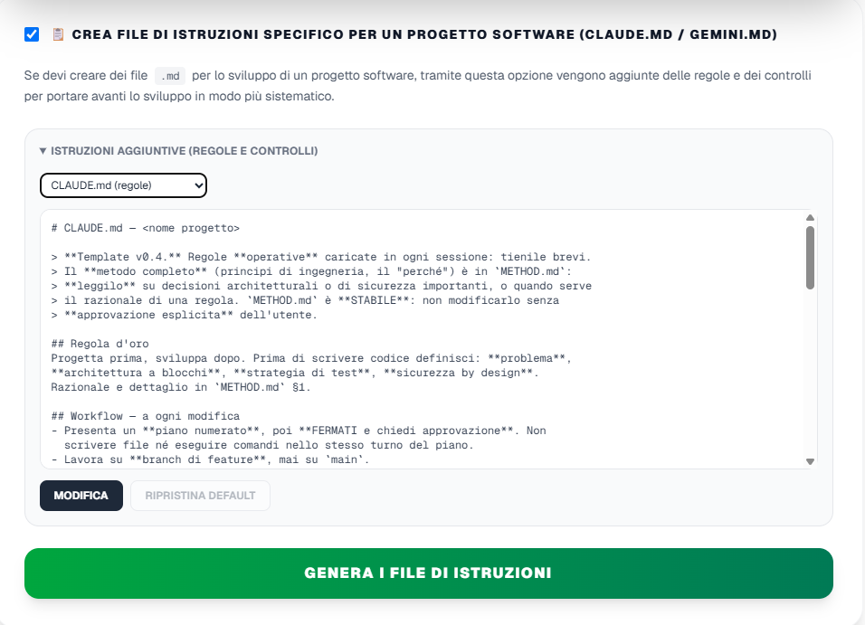
4. Clicca **"Genera i file di istruzioni"** (il pulsante verde nel pannello).
5. Compaiono i **file generati** con l'anteprima; salvali con **"📁 Scrivi in
   cartella…"** oppure **"🗜️ Scarica ZIP"**, poi mettili nel tuo progetto reale.

Gemini compila solo la sezione **"Progetto"**; le regole operative restano quelle
curate (eventualmente personalizzate al punto 3).

---

## 9. Lingua dell'interfaccia

Dal menu **lingua** nell'header scegli tra **Italiano, English, Español,
Français, Deutsch, 中文（简体）, 中文（繁體）, Português (BR), 日本語**. Tutta l'UI si
aggiorna subito e la scelta viene ricordata. Al primo avvio l'app prova a
**rilevare la lingua del sistema** (fallback: italiano).

---

## 10. Log esteso (diagnostica)

Il toggle **"🐞 Log esteso"** nell'header attiva un log dettagliato su file, utile
per diagnosticare un problema. **Richiede il riavvio dell'app** per applicarsi. Il
file di log sta nella cartella dati dell'app (`%APPDATA%\com.prompt.optimizer\`).

---

## 11. Risoluzione problemi

- **SmartScreen "editore sconosciuto":** normale per app non firmate → "Ulteriori
  informazioni" → "Esegui comunque".
- **L'app non si apre / schermo bianco:** probabilmente manca **WebView2**.
  Installalo da [qui](https://developer.microsoft.com/microsoft-edge/webview2/)
  (non servono diritti admin) e riprova.
- **"Rifinisci con … (API)" dà errore `401`:** la API key inserita non è valida →
  ricontrollala in ⚙️ Impostazioni.
- **`429 no credits`:** il tuo account del provider non ha credito → aggiungine.
- **Errore sul modello (`404`/`400`):** l'ID modello potrebbe essere cambiato →
  segnalalo allo sviluppatore.

---

## 12. Privacy e dati

- I **prompt** vengono inviati a **Google Gemini** e — se usi Rifinisci/Valuta via
  API — ad **Anthropic** e/o **OpenAI**.
- Le **API key** (Gemini, Anthropic, OpenAI) sono salvate **solo sul tuo
  dispositivo** e non vengono mai loggate.
- Non esiste alcun **backend proprietario**: le chiamate vanno direttamente agli
  endpoint dei provider.
- L'**anonimizzazione** (§5) maschera i dati personali prima dell'invio al
  modello, ripristinandoli nell'output.
