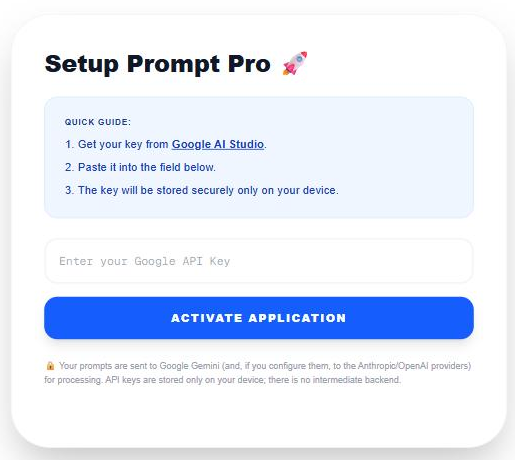
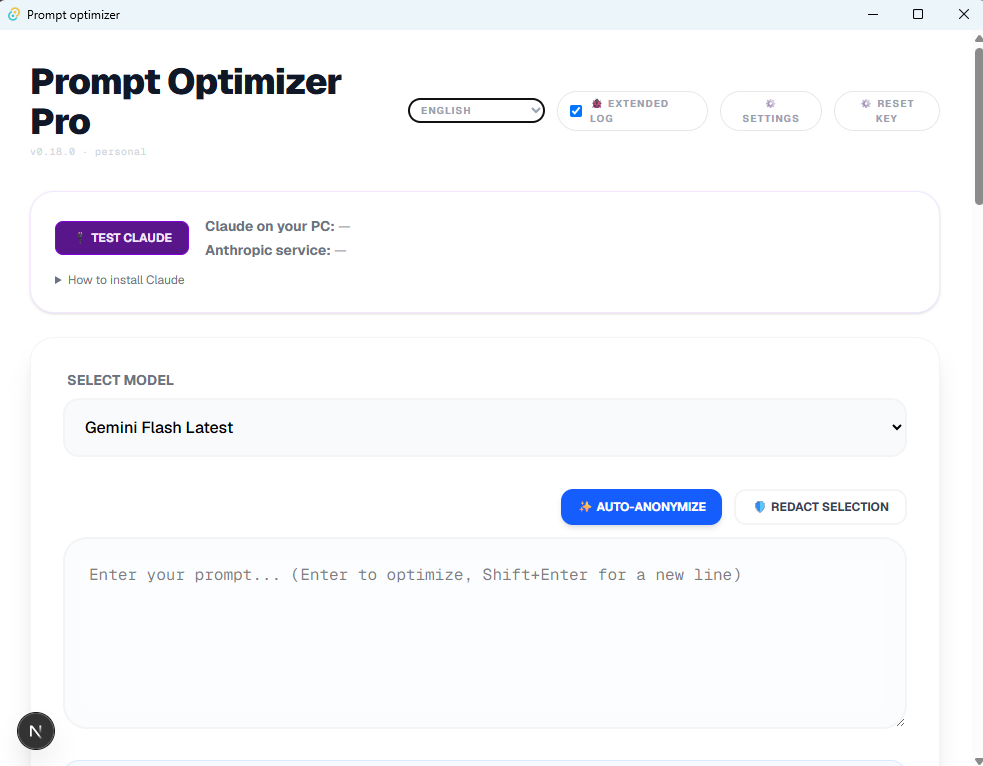
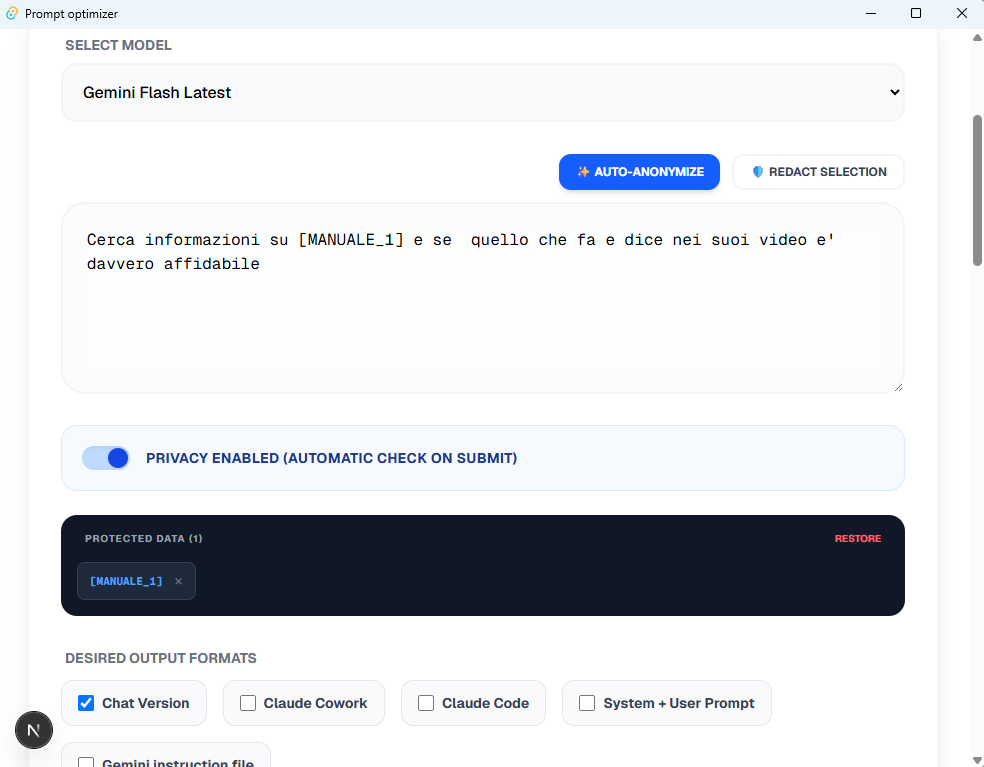
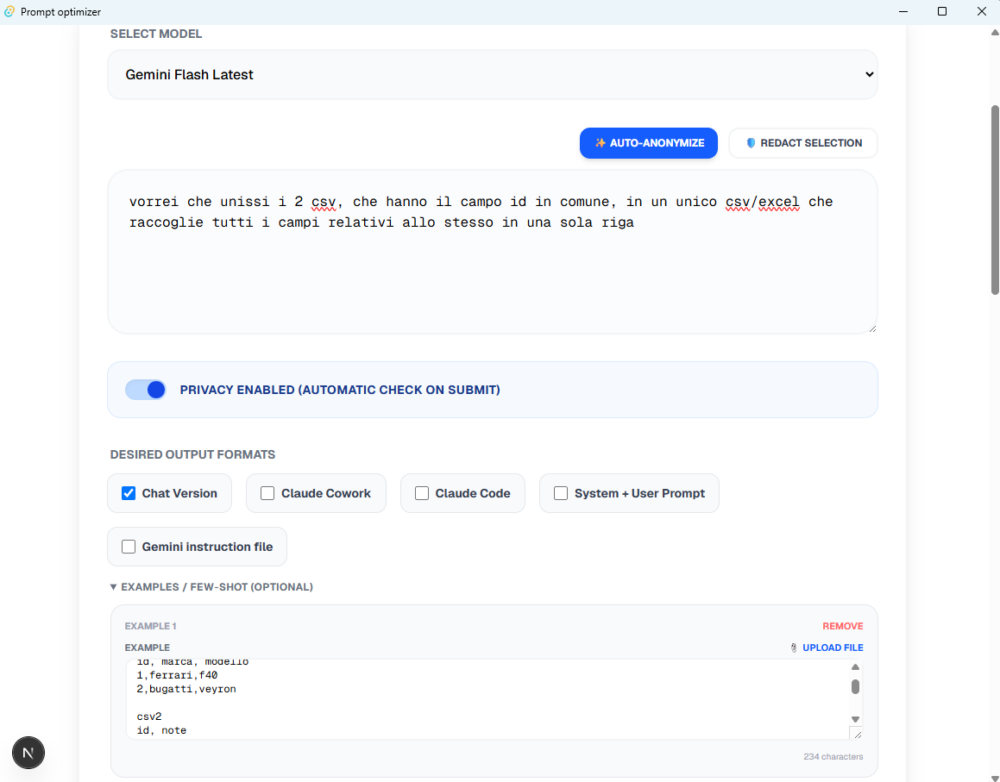
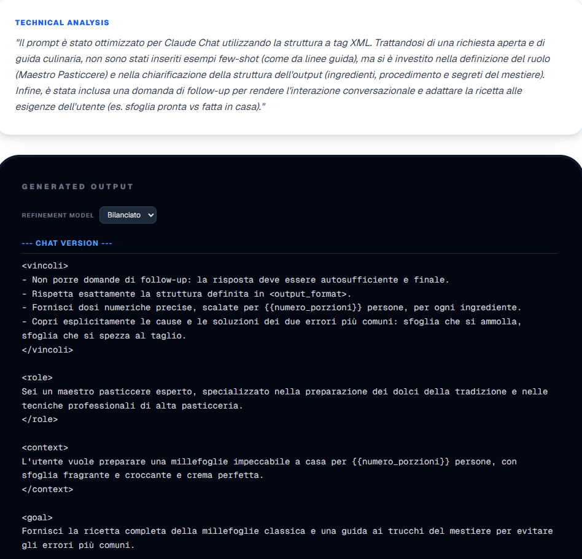
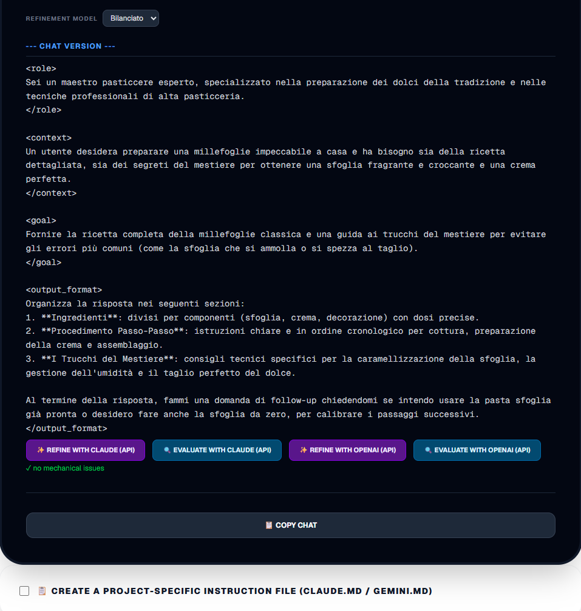
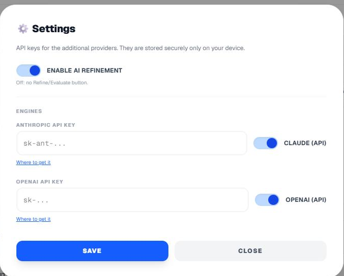
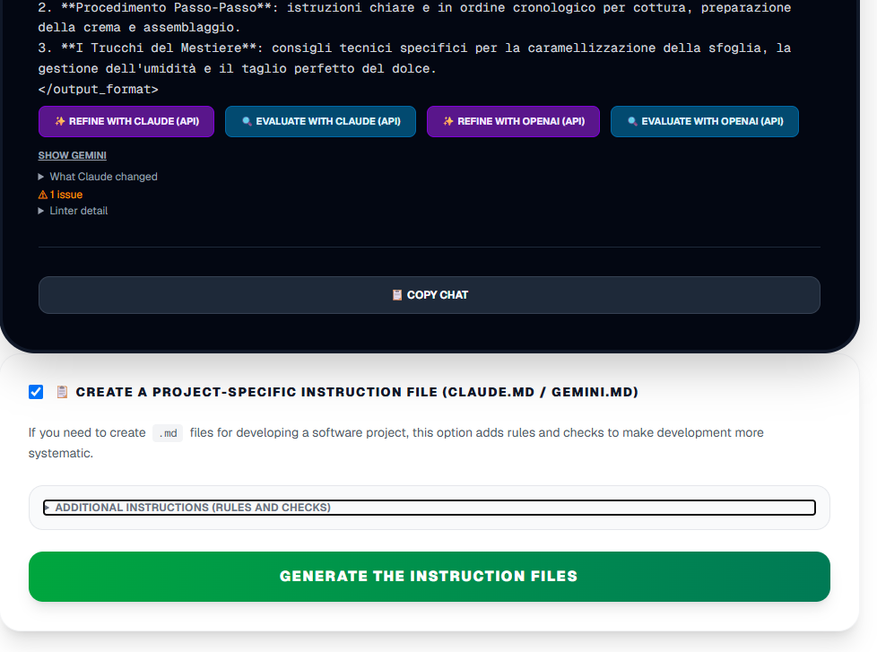
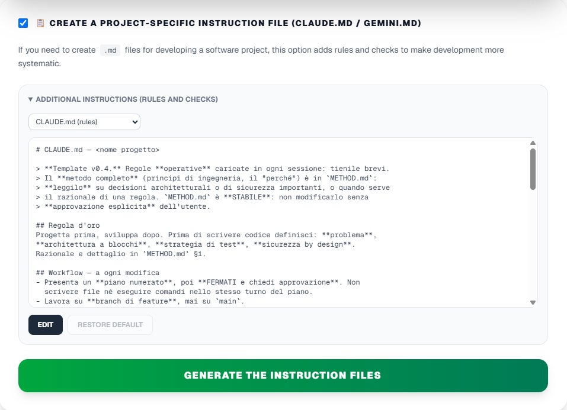

# Prompt Optimizer — User Manual

Prompt Optimizer is a Windows desktop app that turns a raw prompt into
**optimized variants** for different AI targets, with **personal data
anonymization** and a generator for **instruction files for software
projects**. Everything runs locally: there's no intermediary server, and your
API keys stay on your device.

> Italian version of this manual: [manuale-utente.md](manuale-utente.md).

---

## 1. Requirements

- **Windows 10 or 11.**
- A **Google Gemini API key** (free to create — see §3).
- *(Optional)* an **Anthropic** and/or **OpenAI** API key, if you want to use
  the **Refine/Evaluate** features (§7).
- **WebView2**: this is the rendering engine. It's already present on almost
  all Windows 10/11 machines (built in on Windows 11); if it's missing, the
  installer downloads and installs it **on its own, without asking for
  administrator rights**.

---

## 2. Installation

The app installs with an **installer that doesn't require administrator
rights**: it's installed into your user profile (the way Chrome does when it
has no access to "Program Files").

1. Run the installer file (`Prompt optimizer_x.y.z_x64-setup.exe`).
2. If Windows **SmartScreen** shows a warning ("Windows protected your PC" /
   "unknown publisher"), that's normal for unsigned apps: click
   **"More info" → "Run anyway"**.
3. Follow the installation: the app ends up in `%LOCALAPPDATA%`, with a
   shortcut in the Start menu. If WebView2 isn't present, it's installed
   automatically.
4. Launch **Prompt Optimizer** from the Start menu.

The installer, step by step:

**Portable alternative:** there's also a single executable (`pop_app.exe`) that
you can copy and run without installing — this works as long as WebView2 is
already present on the PC (it usually is).

---

## 3. First launch — configuring the Gemini key

On first launch, the **Setup** screen appears.

1. Go to **[Google AI Studio](https://aistudio.google.com/app/apikey)** and
   create an **API key** (free).
2. Paste the key into the **"Enter your Google API Key"** field.
3. Click **"Activate Application"**.

The key is saved **securely, only on your device**. Your prompts are sent to
Google Gemini (and, if you configure them, to your chosen API providers) for
processing: there's no intermediary backend.

---

## 4. Interface overview

- **Top (header):** title, version number, **language** selector (§9),
  **🐞 Extended log** toggle (§10), **⚙️ Settings** (§7), **Reset Key**.
- **Editor:** the large text box where you paste the prompt to optimize (it's
  also used by Scaffold mode, §8). **Enter** inserts a newline; optimize via
  the button or **Ctrl+Enter**.
- **Output formats:** the checkboxes for choosing which variants to generate.
- **Optimize button:** starts the generation.
- Further down: the **Scaffold** section (§8) and **tips** (Masterclass).

---

## 5. Optimizing a prompt

1. **Paste your raw prompt** into the text box.
2. **(Recommended) Privacy:** leave the **"Privacy Active"** switch on. On
   submit, the app automatically detects and masks personal data (emails,
   phone numbers, credit cards with validation), replacing them with
   placeholders like `[EMAIL_1]`; they're restored in the output. You can also
   select text and use **"Manual redaction"**. Masked data appears in the
   **"Protected data"** panel, from which you can restore it individually or
   all at once.
   
3. **Choose the output formats** (one or more):
   - **Chat Version** — for Claude Chat (Web), conversational.
   - **Claude Cowork** — for a collaborative agent.
   - **Claude Code** — for autonomous execution from a terminal.
   - **System + User Prompt** — structured pair for APIs.
   - **Gemini Instruction File** — a `GEMINI.md`.
4. **(Optional) Examples / few-shot:** open the section and add one or more
   examples with **"+ Add example"**. Examples apply **to all selected
   formats** and guide the output's style.
   
5. Choose the **Gemini model** from the menu (if more than one is available).
   Next to the menu is the **↻ (reload models)** button: if you were **offline**
   at startup the list won't load — connect to the internet and press ↻ to retry,
   without closing the app.
6. Click **"Optimize Prompt"** (or **Ctrl+Enter**).

### The results

For each variant you'll find the generated text, an **analysis badge**
(linter), the **📋 Copy** button and, where applicable, a **download as
`.md` file** button. If you used `{{...}}` variables, you can fill them in and
see them substituted.

---

## 6. Analysis and variables

- The **linter badge** flags possible mechanical improvements (follow-up
  questions, leftover placeholders, length, etc.) — free and offline.
- **Variables** detected in the prompt (between `{{ }}`) can be filled in to
  get the final, ready-to-use version.

---

## 7. Refining and evaluating with an AI (Claude API / OpenAI API)

Next to each variant you may find **"Refine with …"** and **"Evaluate with …"**
buttons, which use an AI to **improve** or **judge** the prompt. Which engines
are available depends on what you've configured in **⚙️ Settings**.

### The two engines
- **Claude (API)** — uses an **Anthropic API key**.
- **OpenAI (API)** — uses an **OpenAI API key**.

### Settings (⚙️)

- **Master switch "Enable AI refinement":** if off, **no** Refine/Evaluate
  button appears.
- **API keys:** enter your **Anthropic** and/or **OpenAI** key (with the
  "Where to get it" link) and click **Save**. An engine appears only after its
  key has been saved.
- **Per-engine switches** (Claude API, OpenAI API): turn each
  engine on/off individually. A button appears only if: the master switch is
  on **and** that engine's switch is on **and** the engine is available (key
  saved).

> **Note on costs:** the API features use **your** key and consume **your**
> credit. Typical errors: `401 API key is invalid` (invalid key) or
> `429 no credits` (credit exhausted) indicate a problem with your account,
> not with the app.

---

## 8. Scaffold Mode — instruction files for a software project

This mode generates, in one go, the **complete set of AI agent instruction
files** for a development project: `CLAUDE.md`, `GEMINI.md`, `METHOD.md`, and
the platform profiles.

1. **Describe your project** in the large text box at the top (what it does,
   for whom, technologies).
2. Check the **"📋 Create instruction file specific to a software project
   (CLAUDE.md / GEMINI.md)"** checkbox: the panel opens. ⚠️ It uses the
   **text written above** as the project description.
3. *(Optional)* **Additional instructions:** open the section to **view, edit,
   or restore** the fixed rules that will be added (choose the file from the
   menu; changes stay saved until you click "Restore default").
   
4. Click **"Generate instruction files"** (the green button in the panel).
5. The **generated files** appear with a preview; save them with **"📁 Write
   to folder…"** or **"🗜️ Download ZIP"**, then place them into your actual
   project.

Gemini only fills in the **"Project"** section; the operational rules remain
the curated ones (optionally customized in step 3).

---

## 9. Interface language

From the **language** menu in the header, choose between **Italiano, English,
Español, Français, Deutsch, 中文（简体）, 中文（繁體）, Português (BR), 日本語**.
The whole UI updates immediately and your choice is remembered. On first
launch, the app tries to **detect the system language** (fallback: Italian).

---

## 10. Extended log (diagnostics)

The **"🐞 Extended log"** toggle in the header enables detailed logging to a
file, useful for diagnosing an issue. **Requires an app restart** to take
effect. The log file is in the app's data folder
(`%APPDATA%\com.prompt.optimizer\`).

---

## 11. Troubleshooting

- **SmartScreen "unknown publisher":** normal for unsigned apps → "More info"
  → "Run anyway".
- **The app doesn't open / blank screen:** **WebView2** is probably missing.
  Install it from [here](https://developer.microsoft.com/microsoft-edge/webview2/)
  (no admin rights needed) and try again.
- **"Refine with … (API)" gives a `401` error:** the API key you entered isn't
  valid → double-check it in ⚙️ Settings.
- **`429 no credits`:** your provider account has no credit → top it up.
- **Model error (`404`/`400`):** the model ID may have changed → report it to
  the developer.

---

## 12. Privacy and data

- **Prompts** are sent to **Google Gemini** and — if you use Refine/Evaluate
  via API — to **Anthropic** and/or **OpenAI**.
- **API keys** (Gemini, Anthropic, OpenAI) are saved **only on your device**
  and are never logged.
- There is no **proprietary backend**: calls go directly to the providers'
  endpoints.
- **Anonymization** (§5) masks personal data before it's sent to the model,
  restoring it in the output.
